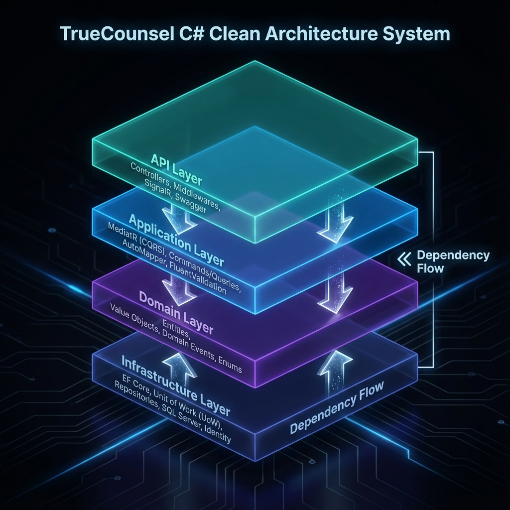
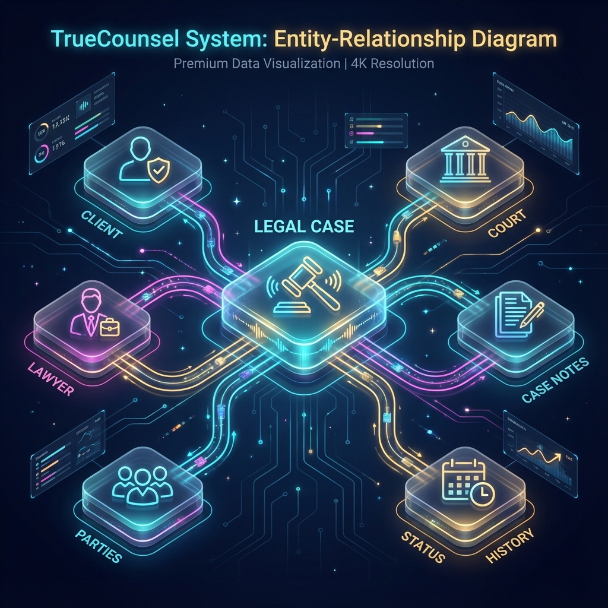

# TrueCounsel

A robust Legal Management System built on .NET 9, following Clean Architecture principles and modern development patterns.

## 🚀 Overview

TrueCounsel is designed to streamline legal workflows, case tracking, and client management. It prioritizes maintainability, scalability, and performance through a decoupled architecture.

## 🛠 Tech Stack

- **Framework:** .NET 9 Web API
- **Layering:** Clean Architecture (Onion)
- **Patterns:** CQRS with MediatR
- **Data Access:** Entity Framework Core (SQL Server)
- **Validation:** FluentValidation with Pipeline Behaviors
- **Mapping:** AutoMapper
- **Security:** JWT (Bearer) Authentication
- **Documentation:** OpenAPI with Scalar UI

## 🏗 Architecture & Data Model



The solution follows **Clean Architecture** principles to ensure separation of concerns and maintainability:

- **TrueCounsel.Domain:** Contains the Enterprise Logic—Entities (LegalCase, Client, Lawyer), Value Objects, Domain Events, and Enums. It has no dependencies on other layers.
- **TrueCounsel.Application:** Contains the Business Logic—CQRS Commands/Queries, MediatR Handlers, DTOs, and AutoMapper profiles. It depends only on the Domain layer.
- **TrueCounsel.Infrastructure:** Contains Implementation details—EF Core DbContext, Repositories, Unit of Work (UoW), and Identity services. It depends on Application and Domain.
- **TrueCounsel.API:** The Presentation layer—Controllers, Middleware, and Filters. It interacts with the system solely through MediatR.

### 📊 Entity Relationship Diagram (Conceptual)



The system is centered around the `LegalCase` entity, which serves as the aggregate root for:
- **Clients & Lawyers:** Managing the primary stakeholders of a case.
- **Courts & Case Types:** Categorizing the jurisdiction and nature of the litigation.
- **Notes & Status History:** Tracking the chronological progress and evidence.

---

## 🔄 Business Logic Flow

The project implements a strict request-response flow to ensure consistency:

1. **API Layer:** Controller receives an HTTP Request → Maps to a **Command/Query DTO**.
2. **MediatR Pipeline:** Command is sent to `IMediator` → Triggers **Validation Behavior** (FluentValidation).
3. **Application Layer:** Handler receives the validated command → Uses **Unit of Work** to interact with Repositories.
4. **Domain Layer:** Business rules are applied to **Entities** → State changes are recorded.
5. **Infrastructure Layer:** **EF Core** persists changes to **SQL Server** through the UoW transaction.
6. **Application Layer:** Result is mapped back to a **DTO** via **AutoMapper**.
7. **API Layer:** Returns the standardized Result via `ProducesResponseType`.

## 🚦 Getting Started

### Prerequisites
- .NET 9 SDK
- SQL Server

### Setup
1. **Clone the repository:**
   ```bash
   git clone https://github.com/Sudip777/true-counsel.git
   ```
2. **Update Connection String:**
   Modify `appsettings.json` in `TrueCounsel.API` with your SQL Server details.
3. **Database Migration:**
   ```bash
   dotnet ef database update --project src/TrueCounsel.Infrastructure --startup-project src/TrueCounsel.API
   ```
4. **Run the API:**
   ```bash
   dotnet run --project src/TrueCounsel.API
   ```

## 📖 API Documentation

Once the application is running, the interactive API documentation (Scalar) is available at:
`https://localhost:PORT/` (Redirects to `/scalar/v1`)

## 🛡 Features

- **Granular Auth:** Secure authentication and identity management.
- **Case Management:** Full lifecycle tracking of legal cases.
- **Client & Lawyer Portals:** Specialized workflows for legal professionals.
- **Validation Pipeline:** Automated request validation via MediatR behaviors.
- **Consistency:** Standardized API responses and error handling.
